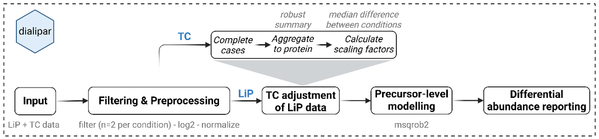

```{r, include = FALSE}
knitr::opts_chunk$set(
  collapse = TRUE,
  comment = "#>"
)
```


## DIA-LiPA Workflow 

dialipar is an R package that includes  data analysis workflow for Lip-MS experiments acquired in DIA mode and searched both with DDA-based or predicted spectral library.
The workflow includes the following steps:

- Filtering and prepocessing 
-  ON TC  run, data is aggrgated to protein level in order to compute scaling factor. 
-  runs on LiP are futher correctect by the scaling factor. 
-  A linear model at precursor level is then employed for the differential expression analysis (based on Msqrob)
 



The R packages, on top of the data analysis steps described include high quality HTML report with some interactive features, that allow  the user to  self dive into their result. 
The package  has one only exported function `render_dialipa_report` that allows the user to process the the DIA Lip MS adata and produce the output report in just one command.


## How to process your DIA-LiP MS with dialipar :

Starting from a folder where you have all the input files `./path/dialipar_test/`, with the following code  you can set the analysis parameters.
`report_target_folder` is the path where all the result are saved, `template_file` contains the template to use for the analysis (only Template.qmd is supported at the moment.).

```{r a}
library(dialipar)
report_target_folder <- "../path/dialipar_test/DIA-LiPA_result"
template_file <- "Template_.qmd"
output_filename <- "DIA-LiPA_report.html"

params_start <- list()
params_start$description <- "DIA-LiPA from DIA-NN input (TC 1 LiP in the same parquet file)"
params_start$design_file <- "../path/dialipar_test/SampleAnnotation.txt"
params_start$input_file_lip <- "../path/dialipar_test/report.parquet"
params_start$input_file_tc <- ""
params_start$fasta_file <- "../path/dialipar_test/SP_9606_PK.fasta"
params_start$folder_prj <- report_target_folder

# Report metadata
params_start$title <- "DIA-LiPA Report"
params_start$subtitle <- "DIA-LiPA"
params_start$author <- "Your Name"

# Analysis parameters
params_start$formula <- "~ -1 + Condition"
params_start$comparisons <- c("ConditionRapa_LiP - ConditionDMSO_LiP")
params_start$FC_thr <- 1
params_start$adjPval_thr <- 0.1
params_start$comparison_label <- c("Rapa - DMSO")
```

you can start your analysis just running `render_dialipa_report` function
```{r  b,  eval = FALSE }
# Run the report rendering
render_dialipa_report(
  params = params_start,
  template = template_file,
  report_folder = report_target_folder,
  report_filename = output_filename
)

```


## More About the parameters

render_dialipa_report takes several parameters grouped by category. Below is a detailed description.


### Input Data and Report Description Parameters

- **title**: Report title
- **subtitle**: Report subtitle
- **author**: Author name
- **description**: Description of the experiment
- **input_file_lip**: Path to the DIA‑NN or Spectronaut report file (parquet)
- **input_file_tc**: Path to the TC (trypsin control) report file (parquet), if separate
- **design_file**: Path to the experiment design file (tab‑separated)
- **fasta_file**: Path to the fasta file
- **folder_prj**: Path to the root output folder for the analysis


`title`, `subtitle`, `author`, `description` alllow users to customize the appearance of the report and add details about the experiment.
Input files such as the parquet reports, experimental design, and FASTA file are specified using `input_file_lip` `input_file_tc` `design_file` `fasta_file`. 

### Data Analysis Parameters

- **formula**: Formula used in MSqrob for the linear model (e.g., "~ -1 + Treatment")
- **contrast**: Name of the column in the experiment design file used in the model (e.g., "Treatment")
- **FC_thr**: log2 fold‑change threshold (default: 1)
- **adjPval_thr**: Adjusted p‑value threshold for significance (default: 0.05)
- **POI**: Proteins of interest, specified using UniProt IDs. If not, POIs will include the proteins with statistal significant precursors.
- **comparisons**: List of comparisons to test, including the variable name specified in the model (e.g., "TreatmentA - TreatmentB")
- **comparison_label**: Human‑readable labels for comparisons (e.g., "GroupA - GroupB" → "A - B")

These parameters control the statistical modelling (`formula`,`contrast`,`comparisons`,`comparison_label`), and the filtering of significant results based on thresholds(`FC_thr`,`adjPval_thr`)

`POI` (Proteins of Interest) is a vector of UniProt IDs for proteins that will be highlighted in the volcano plot and barcode plot. If `POI` is not provided, all proteins with statistically significant precursors will be used.
Currently, the maximum number of POIs supported is 10.

Dialipar supports only simple pairwise comparisons based on a single variable (e.g., Treatment).
`comparisons` should include all contrasts to be tested in the analysis. Each comparison must be formatted as `variable + value` for example  "TreatmentA - TreatmentB".  

## Analysis Output Structure

In addition to the HTML report generated in the directory specified by `folder_prj` (root directory), the analysis produces a structured output with the following content:

- **root_directory** 
  - Html report
  - A log file of the analysis
  - A YAML file storing all the parameters used
- **Result**
    - Includes all quality control (QC) plots, saved as PDF files.
- **Result/Contrast/** 
  - Contains one subfolder for each comparison performed in the analysis.
- **Result/Contrast/comparison_label**
   Within each comparison folder, you will find:
   -  Barcode plots (PDF format) 
   - A toptable CSV file with the statistical results of the model